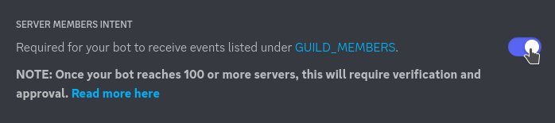

# User Log

Posts messages in a Discord channel when users join or leave.

## Usage

```sh
DUL_TOKEN=your-discord-bot-token \
DUL_GUILD_ID=your-guild-id \
DUL_CHANNEL_ID=your-channel-id \
DUL_STATE_PATH=/path/to/persistent/state.db \
go run main.go
```

See https://discord.com/developers/docs/topics/oauth2#bots for information on creating a Discord bot.

This bot needs the privileged "Server Members Intent" option enabled: Applications -> Bot -> Privileged Gateway Intents -> Server Members Intent


